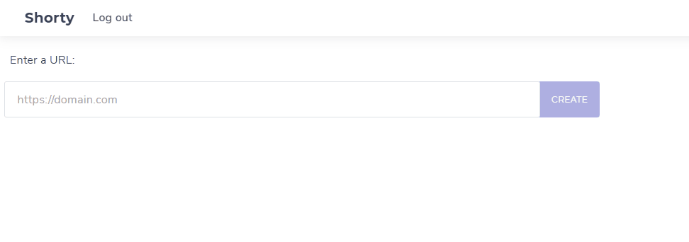

# Shorty

Small application for creating short URLs and a QR code for them.

Uses React run in an Azure Static Web App, Azure Functions as serverless functionality and Azure Table API to store the data. If you don't exaggerate the usage, you can run it without any costs.



Note: I did not write any unit or integration test and just did manually testing yet.

## Setup

_Please read this chapter completely before executing the steps!_

You need the following which can be created via Azure Portal:

- an Azure Static Web App (it uses the Azure Functions within it, so no need to set up Azure Function separately)
- an Azure Storage account

The Azure Static Web App will ask for a Github repo to attach. It will also create the Github Workflow file for it to automatically build and ship the application.

Steps to execute in chronological order:

- clone/fork this repo
- create the Azure Storage account (StorageV2) and create a table called `urls`
- create the Azure Static Web App (free plan, Github connection) and select the cloned/forked repo
- in the Github Actions secret page, create a new secret `REACT_APP_DOMAIN` and set the value to the domain of your site
  - if you keep the automatically generated domain of Azure (something like https://<some-identifier>.azurestaticapps.net) then set this as the value
  - if you'll use your own domain, then set it as value and within the Azure portal create a custom domain for the site in "Custom Domains" at the Azure Static Web App
    )
- adjust the generated workflows file in `.github/workflows/` that will deploy to your Azure Static Web App and ensure that the step `Build and deploy` looks like the following. Note that the secret for the API token will have a different name based on the generated domain name of your app. You need to adjust `app_location`, `api_location`, `output_location` and `env` appropriately:

```
      - name: Build And Deploy
        id: builddeploy
        uses: Azure/static-web-apps-deploy@v1
        with:
          azure_static_web_apps_api_token: ${{ secrets.AZURE_STATIC_WEB_APPS_API_TOKEN_XXX }}
          repo_token: ${{ secrets.GITHUB_TOKEN }} # Used for Github integrations (i.e. PR comments)
          action: "upload"
          ###### Repository/Build Configurations - These values can be configured to match your app requirements. ######
          # For more information regarding Static Web App workflow configurations, please visit: https://aka.ms/swaworkflowconfig
          app_location: "react" # App source code path
          api_location: "functions" # Api source code path - optional
          output_location: "build" # Built app content directory - optional
          ###### End of Repository/Build Configurations ######
        env:
          REACT_APP_DOMAIN: ${{ secrets.REACT_APP_DOMAIN }}
```

- setup the configuration for Azure Functions to tie the Azure Storage account, therefore see [here](DEVELOPMENT.md#setup-for-deployment)
- push the changes - it should deploy and work (fingers crossed :-))
